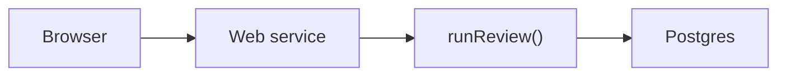
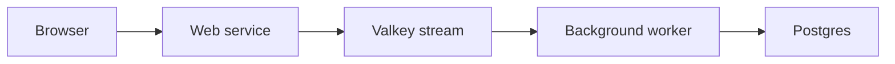
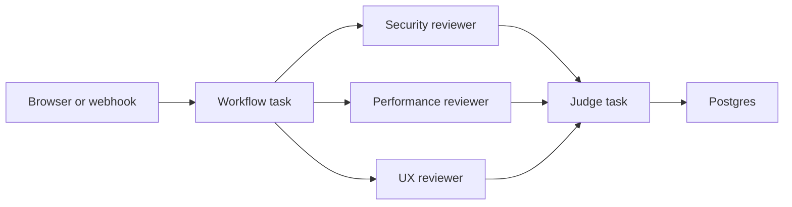

# From Demo to Deploy — Building Agents with Render Workflows

Bulleted slides for the localhost:2026 workshop. Speaker notes are under each
slide. 

---

## Slide 1 — Title

**Building Production-Grade Agents with Render Workflows**

localhost:2026

**Notes**

Hello. I am < Intro yourself >. Today, we're going to build and deploy agents on Render. We'll start simple, with a naive implementation that breaks at scale. Then, we'll look at a more sophsiticated architecture that can support scale, but adds complexity. Last, we'll take a look at Render Workflows, which offers a simple way to build and deploy agents with scalability, orchestration, and observability built-in.


---

## Slide 2 — Why this matters now

**Agent orchestration is a workflow problem first, an AI problem second.**

- 2026: agents are going to production
- The hard parts: orchestration, observability, durability, retries, isolation, scale
- The question: how much of this infrastructure do you own?

**Notes**

Agents are shipping to production this year. The hard part is everything around the model call — making a multi-step chain survive a crash, retrying one failed tool call without replaying the whole run, scaling workloads independently. So the question becomes: how much of that infrastructure do you build and maintain yourself? That question is the spine of today: we'll answer it three times, shifting more of the substrate to the platform each pass.

---

## Slide 3 — One pipeline, three substrates

**The thing we build once, and run three ways**

- A PR goes in. A verdict comes out.
- `prepareDiff → filterDiff → [ security ‖ performance ‖ ux? ] → judge`
- Four specialist agents with tools and an LLM loop
- What changes is *where* and *how* it runs — never the agent

| Pattern | Substrate | Orchestration | Failure mode | Scale |
| --- | --- | --- | --- | --- |
| Pattern 1 | Request-bound web service | None | Timeouts, lost work on deploy | No |
| Pattern 2 | Web service + queue + worker | Queue, acknowledgements, consumer group, retries | Coordination bugs | Yes |
| Pattern 3 | Render Workflows | Managed | App logic | Yes |

**Notes**

We have one code-review pipeline: fetch a PR, filter out noise, fan out specialist reviewers in parallel, then a judge consolidates findings into an approve-or-request-changes verdict. The agents are defined once in a shared package. What changes is the infrastructure that runs them. Hold this table in your head for the entire workshop — the agents are the constant, the substrate is the variable. Pattern 1 has a web service and database, but no separate orchestration layer. Pattern 2 is powerful, but you own the queue and coordination code. Pattern 3 gives you the same power with managed orchestration. We're going to build each one and feel the difference.

---

## Slide 4 — Setup and first run

**Get everyone to a working agent before the first lab**

- Fork the repo into your GitHub account
- In GitHub Actions, run `setup-attendee.yml` to create your namespace
- Clone your fork locally
- Run `npm install`
- Run `npm run setup`
- Keep the tutorial companion open for the exact steps
- Deploy Pattern 1 from `packages/naive-agent/render.yaml`
- Open the Web Service URL and submit the demo PR
- Click a run to inspect findings and spans

**What you're working with**

- `shared/agent/` — the engine: agents, LLM loop, tools, model client
- `shared/db/` — telemetry store (Postgres or in-memory)
- `shared/ui/` — the review viewer (shared by all three)
- `packages/naive-agent/` — Pattern 1
- `packages/worker-agents/` — Pattern 2
- `packages/workflow-agents/` — Pattern 3

**Notes**

This should be a guided code-along, not a deep exercise. The tutorial companion has the exact steps, so the slide should stay at checkpoint level. Start from GitHub so every attendee gets their own fork and generated namespace before they clone locally. Then walk through install, `npm run setup`, and the Pattern 1 deploy. Pattern 1 is worth doing with attendees because it gets them acclimated to the repo, the Render Dashboard, the deployed app, and the review viewer. The goal is a first success moment: everyone has a live agent, everyone has submitted a PR, and everyone has seen a trace. After that, Pattern 1 becomes the baseline we can critique. Pattern 2 is where they feel the coordination pain. Pattern 3 is where they author the platform-native version.

This is an npm workspaces monorepo. Every pattern imports the same agents, the same tools, the same model client.

---

## Slide 5 — Pattern 1: The naive agent

**The simplest thing that works**



- The agent runs *inside* the HTTP request
- `POST /api/reviews` → `await runReview(prUrl)` → respond with verdict
- One import: `runReview` from `@workshop/agent`
- The viewer shows findings and spans — LLM turns, tool calls, everything
- It works. Ship it?

**Notes**

This is the starting point every agent tutorial gives you. The handler awaits the entire review pipeline — four agents, multiple LLM round-trips, tool calls — and only then responds. Open the viewer, submit a PR, watch it complete. The findings are real. The traces show every LLM turn. It works. So what's the problem?

---

## Slide 6 — Break it

**Three ways Pattern 1 fails**

- **Timeouts** — a large PR or a slow model blocks the request. Proxy kills it.
- **Lost on deploy** — redeploy mid-review, the in-flight work is gone. No durable state.
- **No scale** — concurrent users share one process. Parallel reviewers contend for one box.

**Notes**

DEMO: Talk through submitting a large PR — the request hangs. Or talk through what happens when you redeploy while a review is in progress. There's nowhere for the work to live outside this process. The problem isn't the agent. The problem is the execution model. We need to separate the thing that accepts the request from the thing that does the work.

---

## Slide 7 — Pattern 2: Queue + Worker



- The web tier becomes a thin producer — enqueue and return `202`
- A background worker consumes a Valkey stream and runs `runReview`
- The agent code is identical — same import, same function
- What you gain: durability (survives deploys), scale (add workers), async (non-blocking)
- What you pay: you now own the queue

**Notes**

DEMO: Submit a PR and get back 202 immediately. Tail the worker logs — the review runs in the background. Open an SSE stream and watch progress events arrive in real time. Scale to two workers — the consumer group splits the load. Kill the web service mid-review — the worker keeps going. This is powerful. But now open `kv.ts`.

---

## Slide 8 — The price of durability

**Everything in `kv.ts` is coordination code you now own**

- A Redis Stream with `XADD` / `XREADGROUP`
- A consumer group with named consumers
- Blocking reads with `BLOCK 5000`
- Message acknowledgements — `XACK` on success, leave pending on failure
- A pub/sub progress bus — `PUBLISH` / `SUBSCRIBE`
- A consumer loop that must never crash

**Notes**

The stream. The consumer group. Blocking reads. Message acknowledgements. Retries. The pub/sub bus for progress. The consumer loop that has to keep running even when a handler fails. These are all now your concern. This is the price of durability when you own the substrate. 

---

## Slide 9 — Lab 1: Hand-write message acknowledgements

**Implement `processEntry` in `kv.ts`**

- Handle one delivered stream entry
- On success → `XACK` (group never redelivers)
- On failure → don't ack, don't rethrow (message stays pending, loop keeps running)
- Verify: `npm run test:worker` (red → green)
- You just implemented at-least-once delivery

**Notes**

This is Session 1's hands-on. Open `processEntry` in `packages/worker-agents/src/kv.ts`. It currently throws. Your job: parse the entry, run the handler, then acknowledge the message on success. In Redis Streams, that acknowledgement is the `XACK` command. If the handler throws, log and return — never ack, never rethrow. The ack goes inside the try, after the handler. The catch logs and returns. Two tests flip from red to green: one checks that a success is acked, one checks that a failure stays pending. Give it 10 minutes. 

---

# — BREAK —

---

# SESSION 2 — Let the Platform Do It (~45 min)

---

## Slide 10 — Pattern 3: Render Workflows

**Same fan-out. Zero coordination code.**



- Each agent runs as a Render `task()` — its own isolated container
- `task()` = a config object + an async function
- Retries, timeouts, compute size, traces — declarative
- Composition is function calls: call a task from a task, `Promise.all` to fan out
- The queue, the consumer group, the acknowledgements, the pub/sub — gone

**Notes**

This is the payoff. Same pipeline, same agents, same tools. But now every reviewer runs as its own Render task — isolated, retried, traced. The entire coordination layer from `kv.ts` collapses into a config object: `retry: { maxRetries: 2, waitDurationMs: 1000 }`. You don't write a queue. You don't write message acknowledgements. You don't manage a consumer group. You write a function and a config. Render does the rest.

---

## Slide 11 — The bridge: `agentTask.ts`

```ts
task(agent.name, async (input, runId?) => {
  return agent.run(input, { tracer, runId });
});
```

- One function wraps any shared agent as a Render task
- Each call runs in its own container
- Retries are per-task, not per-pipeline
- Spans are recorded automatically — every LLM turn, every tool call

**The `task()` API**

**Everything you need to know**

```ts
export default task(
  {
    name: "your-review",
    timeoutSeconds: 120,
    retry: { maxRetries: 2, waitDurationMs: 1000, backoffScaling: 2 },
  },
  async function yourReview(input) {
    // your logic — any async function
  },
);
```

| You write | Render gives you |
| --- | --- |
| `retry: { maxRetries: 2, … }` | automatic retries with backoff, in a fresh instance |
| `await someTask(input)` | isolation — each task runs in its own container |
| nothing | a full trace of every task and sub-task |

**Notes**

This is `agentTask.ts`. It's the only Pattern-3-specific code. `agent.run()` is the same call naive-agent and worker-agents make. Wrapping it in `task()` is what buys isolation, retries, and traces. That's the entire abstraction.

This is the entire API surface. A config object and a function. Name, timeout, retry behavior, optional compute size. That's it. The retries you hand-wrote in Lab 1 — the ack inside the try, the catch that swallows errors — are now `maxRetries: 2`. Same guarantee. Config object.

---

## Slide 12 — Lab 2: Author a task

**Your turn — extend `your-review`**

1. **Preview it:** `render workflows tasks list --local` → `your-review` is already there
2. **Compose an agent as a task:**
   ```ts
   const securityTask = agentTask(securityReviewer);
   const review = await securityTask({ patches });
   ```
   — nested `security` task appears in the trace
3. **Force a retry:** `if (Math.random() < 0.5) throw new Error("flaky!");` — watch Render retry in a fresh instance. Remove after.
4. **Fan out:** `REVIEWERS.map(agentTask)` + `Promise.all` — same shape as `code-review`
5. **Ship it live:** push, release, start the task, open the trace

**Notes**

Open `your-review/index.ts`. It fetches a diff and returns an overview. It's your turn to extend it. Compose an agent as a nested task. Force a failure and watch the retry. Fan out all reviewers. Each step has a payoff, and each step reinforces the lesson: the capability is yours to write, the durability is the platform's. Coding agents welcome — the `task()` API is small enough that they can reason about them directly.

---

## Slide 13 — What you just built

**A durable, traced, multi-agent workflow**

- Specialist agents fan out in parallel, each in its own container
- Automatic retries with backoff — no try/catch, no dead-letter queue
- Full traces — every task, every LLM turn, every tool call
- Zero queue code. Zero consumer groups. Zero acknowledgement logic.

**Notes**

The only infrastructure you wrote was a function and a config object. Everything else — the queue, the retries, the isolation, the traces — is handled by the platform.

---

## Slide 14 — Where to go from here

**The production frontier**

- **Evals** — a labeled corpus + a scoring runner. Each case is a task. Fan out over the corpus.
- **Guardrails** — input sanitization, output validation, tool allow/deny lists. More steps, same pipeline.
- **Circuit breakers** — per-run budgets, model-tier fallbacks, backpressure caps. Config + a small state check.
- **Observability** — the tracer interface is the seam. Export spans to OpenTelemetry alongside the built-in viewer.
- **MCP tools** — `defineMcpSource` makes a tool available to all three patterns at once.

---

## Slide 15 — The takeaway

- Pattern 1: simple, but fragile
- Pattern 2: powerful, but you own the hard parts
- Pattern 3: same power, the platform owns the hard parts
- Agents are the logic you write. Workflows are the infrastructure you don't.

**Resources**

- **This repo:** all three patterns, the mock model, the full test suite
- **Docs:** `docs/00` through `docs/05` — the guided walkthrough
- **Render Workflows:** `render.com/docs/workflows`
- **Bonus points:** reflection loops, MCP tools, HITL gates → `docs/04-author-a-task.md`

**Notes**

Everything is in the repo. The guided docs walk through each pattern. The bonus points in doc 04 have three deeper challenges — a judge reflection loop, wiring in an MCP tool, and a human-in-the-loop gate. Each one reinforces the same lesson. The mock model means you can keep going with zero credentials. Thank you all.
